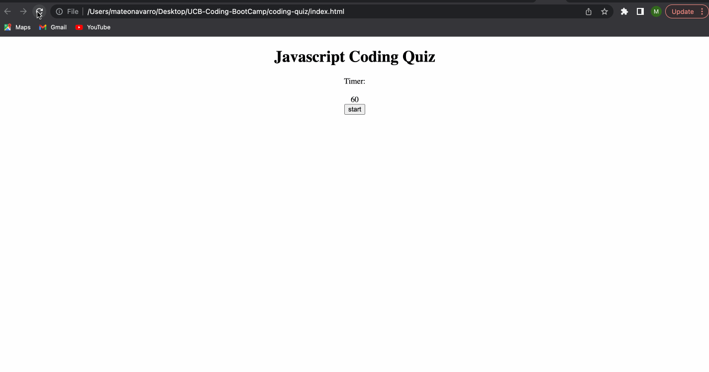

# Coding Quiz

## Description 

Coding quiz to test your knowledge! 

## Visuals

## Usage

Press start button to begin the quiz! You will then be presented with a series of questions. You have 60 seconds to answer all of them, but be careful to answer any question incorrectly or 5 seconds will be deducted from the timer! Once quiz is complete or time has elapsed you can save your score and see how you rank against others!

## Code

1. HTML
2. CSS
3. Javascript

## Links

1. https://github.com/mateonav98/coding-quiz
2. https://mateonav98.github.io/coding-quiz/

## Author

Mateo Navarro

LinkedIn: https://www.linkedin.com/in/mateonav

GitHub: https://github.com/mateonav98